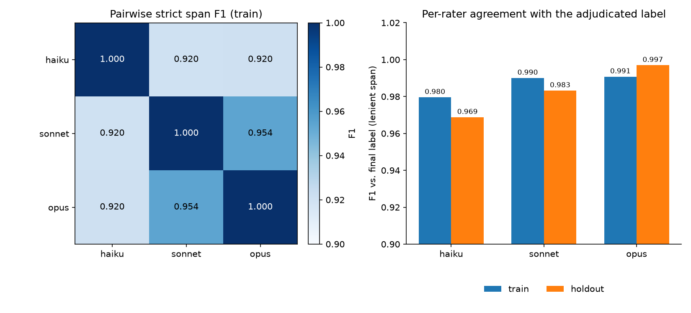
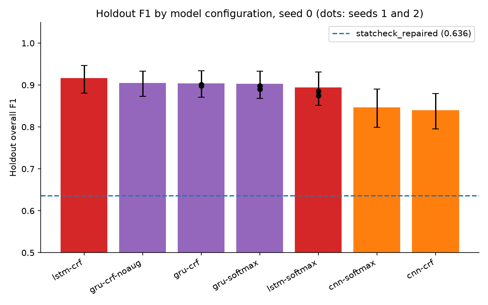
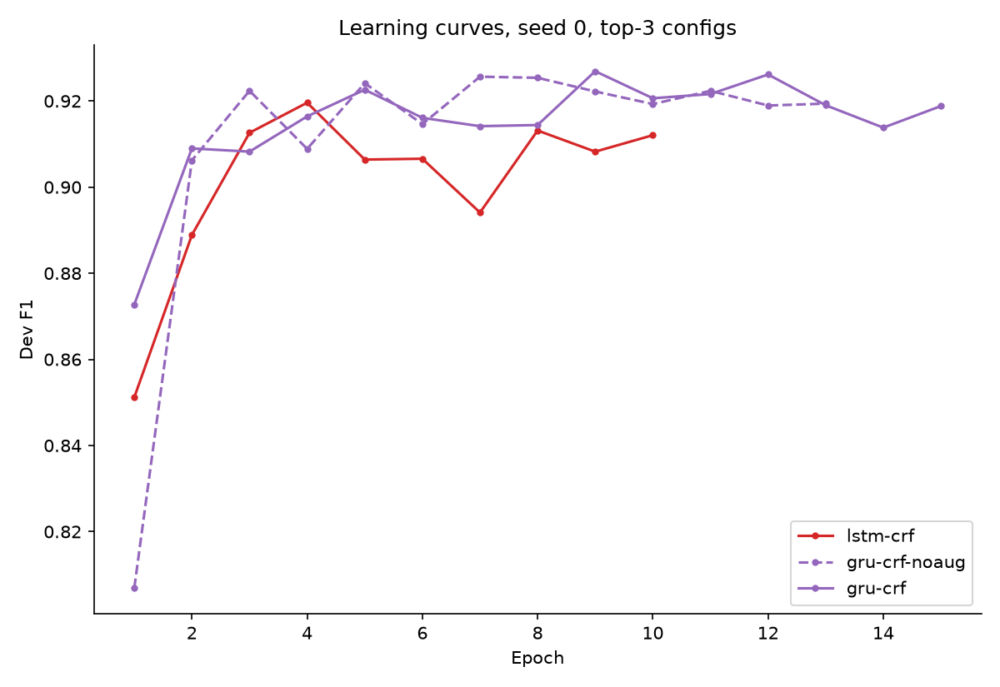
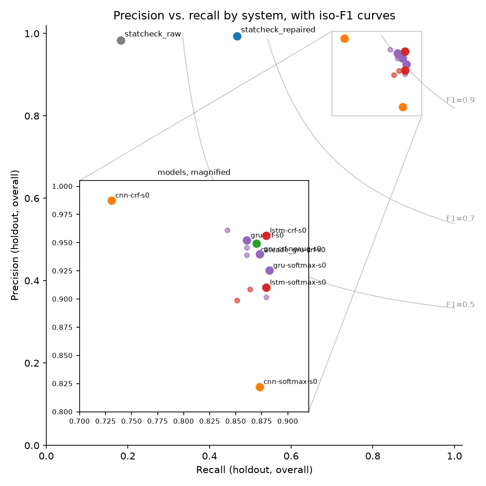
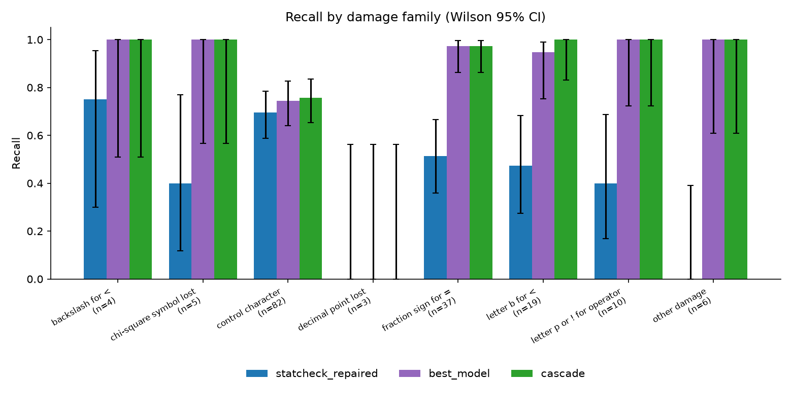
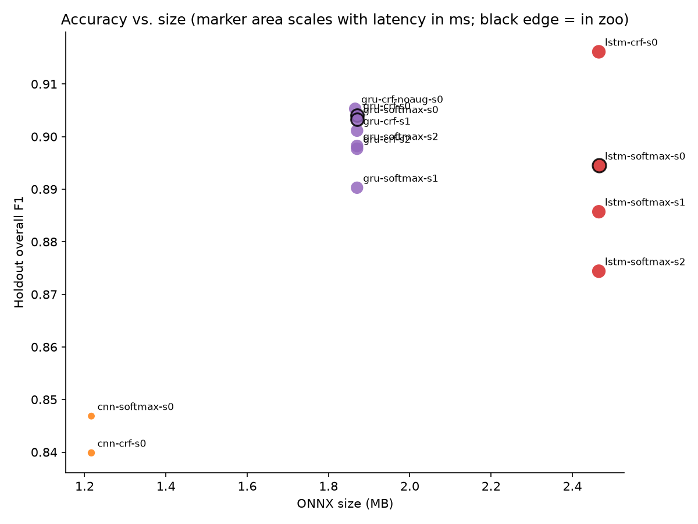

# statcheck-ml — results report

Generated from commit 39c2077 (2026-09-20T13:58:54+02:00). Every number in this
report comes from a committed measurement file. `pipeline/11_report.py` fills this
template. No number is typed by hand.

## Abstract

statcheck-ml replaces the regular-expression extraction step of the R package
`statcheck` with a small character-level model, and keeps the p-value arithmetic
exact. Version 2 rebuilt the process so that a third party can rerun every stage after
the annotation from committed files. Three rater agents annotated every window blind
under a versioned guideline. A scripted consensus rule and an adjudicator agent turned
the three readings into one bronze label per result. Six character-level model
configurations were trained with seeds, exported to ONNX, and evaluated once on a
holdout of unseen documents with bootstrap intervals and paired tests. The cascade of
`statcheck` with operator repair followed by the best model reaches holdout F1
0.908 [0.875, 0.937], against 0.636 for `statcheck`
with repair alone and 0.308 for `statcheck` on the raw text.

## 1 Data

The corpus holds 3100 open-access articles from psychology, sociology, political
science, economics, education, and management. Each article was converted to text
with PyMuPDF. A window is one candidate line with two context lines on each side,
grown to at least 250 characters. The sampler drew windows from five pools. Pool A:
the `statcheck` pattern matched a complete result. Pool AN: pool A with a negative
statistic. Pool B1: a p-value is present, but no complete match. Pool B2: a test
letter and digits, but no p-value. Pool C: the density prefilter rejected the line.

Three raters annotated 1962 training windows from
1304 documents, and 576 holdout windows from
515 documents. The holdout documents are disjoint from the
training documents. Every label is bronze: a rater agent wrote it, and no person
checked it.

| Set | Windows | Documents | Results | Damaged | Damaged share |
|---|---|---|---|---|---|
| train | 1962 | 1304 | 1517 | 692 | 45.6% |
| holdout | 576 | 515 | 327 | 168 | 51.4% |

Training pools: A 120, AN 42, B1 600, B2 900, C 300. Holdout pools: A 36, B1 180, B2 270, C 90. The damaged share
of training results is 45.6%, and of holdout results
51.4%, out of 1517 and
327 results. A damaged result is one where the PDF conversion
replaced an operator or a sign with a wrong character. This share is the reason the
project exists: a pattern cannot read an operator it does not know in advance, and a
model that reads the surrounding characters can.

## 2 Annotation protocol

Three rater agents read every window: one Claude haiku, one Claude sonnet, and one
Claude opus. Different model families give raters that do not share one training run.
Each rater received one batch of twenty windows and the guideline, version 2.0
(`docs/GUIDELINE.md`), and wrote one JSON file per batch. The rater saw no pool label,
no other rater's output, and no repository file. A collect script validated every
output against the guideline contract: the batch length, the window order, the nine
result keys, the operator set, and the confidence set. The script aligned each quoted
result to its character span in the window, with whitespace ignored, and stamped each
record with the rater, the model id, the sha256 of the guideline, the sha256 of the
agent file, the batch id, the collection time, and the retry count. A batch that
failed a rule was dispatched again, and the retry count records it.

One limit of this design stays written down. An agent inside Claude Code holds a Read
tool, so blindness is an instruction, not a sandbox. The three raters also share a
model family, so their agreement cannot detect a mistake that all three make.

Each rater returned 1468 (haiku), 1493
(sonnet), and 1511 (opus) results on the training windows.

| Set | Rater | Windows annotated | Results found | Results / window |
|---|---|---|---|---|
| train | haiku | 1962 | 1468 | 0.75 |
| train | sonnet | 1962 | 1493 | 0.76 |
| train | opus | 1962 | 1511 | 0.77 |
| holdout | haiku | 576 | 313 | 0.54 |
| holdout | sonnet | 576 | 328 | 0.57 |
| holdout | opus | 576 | 325 | 0.56 |

## 3 Agreement

Agreement is measured at three levels. At the window level, the unit is the binary
decision `contains_result`, and the metrics are the raw percent agreement, the
pairwise Cohen kappa, the Fleiss kappa for three raters, and the nominal Krippendorff
alpha. At the result level, the unit is one aligned result span. Two results match
strictly when their spans are equal, and leniently when the overlap covers at least
half of the shorter span. The metric is the pairwise span F1, and the mean over the
three pairs. At the field level, the unit is one result that all three raters found,
and the metric is the nominal Krippendorff alpha for `test_type`, `p_operator`, and
`damaged`, and the exact-match share for the numeric fields. Every value carries a 95
percent percentile bootstrap interval over windows, from one thousand resamples with
seed 0. The convention of Landis and Koch calls a kappa above 0.81 "almost perfect".
The report uses that word as a convention, not as a claim about truth.

Window-level Fleiss kappa is 0.979 [0.972, 0.986] on training and
0.970 [0.952, 0.985] on holdout; Krippendorff alpha is
0.979 [0.972, 0.986] and 0.970 [0.953, 0.985].
Mean strict-span result F1 is 0.931 [0.917, 0.944]
(train) and 0.929 [0.898, 0.955] (holdout); mean
lenient-span F1 is 0.980 [0.975, 0.985] and
0.970 [0.955, 0.984]. The gap between the strict
and the lenient value is the share of results the raters found together but bounded
differently, for example a quote that includes or excludes a trailing p-value.

| Set | Raw % agreement [CI] | Fleiss kappa [CI] | Krippendorff alpha [CI] |
|---|---|---|---|
| train | 98.5% [0.979, 0.990] | 0.979 [0.972, 0.986] | 0.979 [0.972, 0.986] |
| holdout | 97.9% [0.967, 0.990] | 0.970 [0.952, 0.985] | 0.970 [0.953, 0.985] |

| Set | Mode | Pair | F1 [CI] |
|---|---|---|---|
| train | strict | haiku-opus | 0.920 [0.901, 0.937] |
| train | strict | haiku-sonnet | 0.920 [0.901, 0.936] |
| train | strict | sonnet-opus | 0.954 [0.939, 0.967] |
| train | strict | mean | 0.931 [0.917, 0.944] |
| train | lenient | haiku-opus | 0.974 [0.967, 0.981] |
| train | lenient | haiku-sonnet | 0.977 [0.970, 0.984] |
| train | lenient | sonnet-opus | 0.989 [0.984, 0.993] |
| train | lenient | mean | 0.980 [0.975, 0.985] |
| holdout | strict | haiku-opus | 0.934 [0.899, 0.965] |
| holdout | strict | haiku-sonnet | 0.911 [0.867, 0.948] |
| holdout | strict | sonnet-opus | 0.940 [0.903, 0.973] |
| holdout | strict | mean | 0.929 [0.898, 0.955] |
| holdout | lenient | haiku-opus | 0.966 [0.945, 0.983] |
| holdout | lenient | haiku-sonnet | 0.958 [0.934, 0.978] |
| holdout | lenient | sonnet-opus | 0.986 [0.972, 0.997] |
| holdout | lenient | mean | 0.970 [0.955, 0.984] |

The field table shows where the raters disagree once they have found the same result.
The test type is almost never disputed. The operator and the `damaged` flag are the
fields with the lowest agreement, because a damaged operator must be inferred from the
context, and the statistic value follows, because a damaged minus sign changes the
copied value.

| Set | Field | Agreement [CI] |
|---|---|---|
| train | damaged | 97.2% [0.960, 0.983] |
| train | df1 | 98.5% [0.975, 0.993] |
| train | df2 | 99.1% [0.982, 0.998] |
| train | n | 99.4% [0.988, 0.999] |
| train | p_operator | 95.2% [0.933, 0.969] |
| train | p_value | 98.0% [0.966, 0.990] |
| train | statistic | 95.5% [0.940, 0.967] |
| train | test_type | 99.9% [0.998, 1.000] |
| holdout | damaged | 90.9% [0.852, 0.958] |
| holdout | df1 | 97.4% [0.950, 0.993] |
| holdout | df2 | 99.4% [0.979, 1.000] |
| holdout | n | 96.8% [0.937, 0.990] |
| holdout | p_operator | 91.6% [0.860, 0.964] |
| holdout | p_value | 99.0% [0.969, 1.000] |
| holdout | statistic | 96.8% [0.941, 0.987] |
| holdout | test_type | 100.0% [1.000, 1.000] |

The last table scores each rater against the final label. It answers a practical
question: which model is the best cheap annotator under this guideline.

| Set | Rater | P | R | F1 |
|---|---|---|---|---|
| train | haiku | 0.996 | 0.964 | 0.980 |
| train | opus | 0.993 | 0.989 | 0.991 |
| train | sonnet | 0.998 | 0.982 | 0.990 |
| holdout | haiku | 0.990 | 0.948 | 0.969 |
| holdout | opus | 1.000 | 0.994 | 0.997 |
| holdout | sonnet | 0.982 | 0.985 | 0.983 |

*Pairwise strict-span F1 and per-rater agreement with the adjudicated label*

## 4 Adjudication

A scripted consensus rule turns the three readings into one label. Results are
clustered across raters with the lenient matcher. A cluster that holds at least two
raters is kept, and each field takes the value that at least two raters wrote. Two
kinds of cluster go to an adjudicator agent (Claude opus): a singleton, which one rater
alone found, and a field conflict, where all three raters wrote a different value. The
adjudicator sees the passage and the candidate results without rater names, and
returns keep or reject with one reason. Every dispute, every candidate, and every
decision is committed in `dataset/annotations/<set>/disputes.json`.

Each kept result carries a tier. `unanimous`: all three raters found it and agreed on
every field. `majority`: two raters found it, or a field was decided by vote.
`adjudicated`: the adjudicator decided it. All three tiers are bronze.

Training had 53 disputes, 36 of them
kept after adjudication; holdout had 19 disputes,
10 kept. Kept-result tiers on training:
1064 unanimous, 417 majority,
36 adjudicated. Training disputes split into
37 singletons (20 kept) and
16 field conflicts.

**Disputes by kind**

| Set | Kind | Total | Kept | Rejected |
|---|---|---|---|---|
| train | field_conflict | 16 | 16 | 0 |
| train | singleton | 37 | 20 | 17 |
| holdout | field_conflict | 5 | 5 | 0 |
| holdout | singleton | 14 | 5 | 9 |

**Kept-result tiers**

| Set | Windows | Tier: adjudicated | Tier: majority | Tier: unanimous |
|---|---|---|---|---|
| train | 1962 | 36 | 417 | 1064 |
| holdout | 576 | 10 | 106 | 211 |

## 5 Models

Every candidate model is character level. It reads one character map, which ports to
Python, JavaScript, and R without a tokenizer. Three families were trained: a
bidirectional LSTM, a bidirectional GRU, and a dilated character CNN. Each family has
two heads: a softmax over the 37 BIOES tags, or a linear-chain CRF above the same
emissions. The CRF runs outside the ONNX graph and ships as a small JSON decoder.

The protocol has three stages. First, the six configurations were trained with seed 0
for up to thirty epochs, with augmentation on: two perturbed copies of each training
window and four hundred generated hard negatives. Early stopping used the dev split
with a patience of six epochs. Second, the top three configurations by dev F1 were
trained again with seeds 1 and 2. Third, the best configuration was trained once more
without augmentation. Model selection used the dev split only. The holdout was
evaluated once per final model. All training ran on CPU, and every run records its
wall time, its git commit, and its torch version in `models/runs.json`.

The grid ran 13 training runs, 8.149 CPU hours in
total. The best screen configuration by dev F1 is gru-crf; its holdout F1 is
0.904 [0.871, 0.934]. The three configurations shipped to the zoo are:
gru-crf, gru-softmax, lstm-softmax.

| Config | Params | Dev F1 | Holdout F1 [CI] | Wall min |
|---|---|---|---|---|
| gru-crf | 468,104 | 0.927 | 0.904 [0.871, 0.934] | 49.9 |
| gru-softmax | 466,661 | 0.924 | 0.903 [0.868, 0.933] | 68.5 |
| lstm-softmax | 615,141 | 0.921 | 0.894 [0.851, 0.932] | 36.3 |
| lstm-crf | 616,584 | 0.920 | 0.916 [0.881, 0.946] | 26.2 |
| cnn-crf | 305,160 | 0.869 | 0.840 [0.795, 0.879] | 16.7 |
| cnn-softmax | 303,717 | 0.858 | 0.847 [0.799, 0.890] | 29.8 |

The seed table shows how much of the difference between configurations is noise. A
difference smaller than the seed spread of either configuration is not a finding.

| Config | Mean F1 (+/- sd) | Values |
|---|---|---|
| cnn-crf | 0.840 (+/- 0.000) | 0.840 |
| cnn-softmax | 0.847 (+/- 0.000) | 0.847 |
| gru-crf | 0.901 (+/- 0.003) | 0.904, 0.901, 0.898 |
| gru-crf-noaug | 0.905 (+/- 0.000) | 0.905 |
| gru-softmax | 0.897 (+/- 0.005) | 0.903, 0.890, 0.898 |
| lstm-crf | 0.916 (+/- 0.000) | 0.916 |
| lstm-softmax | 0.885 (+/- 0.008) | 0.894, 0.886, 0.874 |

Three findings follow from these two tables. First, the three recurrent configurations
in the zoo are one group: the seed spread of each is as large as the gap between them,
and section 7 confirms it with paired tests. Second, the CRF head adds nothing
measurable to the GRU. For the LSTM the single CRF run scores above the three softmax
runs, but with one seed that is not a finding by the rule above. Version 1 reported a
CRF advantage on single-pass labels; on the three-rater labels the emissions alone are
cleaner. Third,
the CNN family is below the recurrent families on every measure, and 1
run diverged during training: cnn-crf-s0 at epoch 6 (loss 10.5 to 518, dev F1 0.059). Early stopping kept the checkpoint
from before the divergence, so the score in the table is that checkpoint's.

The configuration with the highest holdout F1 is lstm-crf
(0.916, dev F1 0.920). It is in the zoo: no.
Selection used the dev split, as the protocol fixed in advance, and the holdout score
does not change that choice. Its interval overlaps the intervals of the three shipped
configurations.

The ablation, gru-crf-noaug-s0, reaches holdout F1 0.905 against
0.904 for the same configuration with augmentation, and recall
0.849 against 0.843 on the damaged subset. The
augmentation gives no measurable gain on this holdout. The damage families it
imitates are already present in the three-rater training labels at a rate close to the
holdout's (section 1), so the model learns them from real text.

*Holdout F1 by model configuration, seed 0, with seeds 1-2 of the top three*

*Dev F1 per epoch, seed 0, top-three configs*

## 6 Evaluation

Four kinds of system were scored on the holdout. `statcheck_raw` is the R package on
the raw window text. `statcheck_repaired` is the same package after the arithmetic
operator repair, which tries each operator for a damaged character and keeps the one
whose recomputed p-value agrees with the reported one. Each model run is one ONNX
export, decoded with its own CRF decoder when it has one. The cascade runs
`statcheck_repaired` first and adds only what the model finds beyond it.

A predicted result matches a gold result when both sit in the same window and their
normalised statistic values are equal. This is the version 1 rule, kept so that the
numbers stay comparable. The subsets are: results with a damaged operator and without;
each test type; each damage family, named from the damaged character; and checkable
results, which carry a statistic, a first degrees of freedom, and a p-value.

`statcheck` alone reaches F1 0.308 (recall 0.183) on
raw text and 0.636 (recall 0.467) after
operator repair. The cascade reaches 0.908 [0.875, 0.937].
The match key is the pair of window and statistic value. The holdout holds
327 results; 2 gold statistics could not be
parsed as a number, and the rest collapse to 323 distinct keys
(166 damaged, 202 checkable), because two
results in one window can carry the same value. Unparseable results are excluded from
every match in this section, in both directions.

| System | P | R | F1 [CI] |
|---|---|---|---|
| cascade_gru-crf-s0 | 0.949 | 0.870 | 0.908 [0.875, 0.937] |
| cnn-crf-s0 | 0.987 | 0.731 | 0.840 [0.795, 0.879] |
| cnn-softmax-s0 | 0.822 | 0.873 | 0.847 [0.799, 0.890] |
| gru-crf-noaug-s0 | 0.940 | 0.873 | 0.905 [0.873, 0.934] |
| gru-crf-s0 | 0.952 | 0.861 | 0.904 [0.871, 0.934] |
| gru-crf-s1 | 0.946 | 0.861 | 0.901 [0.868, 0.931] |
| gru-crf-s2 | 0.961 | 0.842 | 0.898 [0.866, 0.926] |
| gru-softmax-s0 | 0.925 | 0.882 | 0.903 [0.868, 0.933] |
| gru-softmax-s1 | 0.902 | 0.879 | 0.890 [0.855, 0.923] |
| gru-softmax-s2 | 0.939 | 0.861 | 0.898 [0.865, 0.930] |
| lstm-crf-s0 | 0.956 | 0.879 | 0.916 [0.881, 0.946] |
| lstm-softmax-s0 | 0.910 | 0.879 | 0.894 [0.851, 0.932] |
| lstm-softmax-s1 | 0.909 | 0.864 | 0.886 [0.848, 0.919] |
| lstm-softmax-s2 | 0.899 | 0.851 | 0.874 [0.835, 0.912] |
| statcheck_raw | 0.983 | 0.183 | 0.308 [0.222, 0.385] |
| statcheck_repaired | 0.993 | 0.467 | 0.636 [0.567, 0.698] |

The damaged subset is where the model earns its place. `statcheck` cannot read a
damaged operator, so its recall on this subset is near the share of results whose
damage sits outside the operator.

| System | P | R | F1 [CI] |
|---|---|---|---|
| cascade_gru-crf-s0 | 1.000 | 0.855 | 0.922 [0.881, 0.958] |
| cnn-crf-s0 | 1.000 | 0.801 | 0.890 [0.843, 0.930] |
| cnn-softmax-s0 | 1.000 | 0.867 | 0.929 [0.891, 0.960] |
| gru-crf-noaug-s0 | 1.000 | 0.849 | 0.919 [0.879, 0.954] |
| gru-crf-s0 | 1.000 | 0.843 | 0.915 [0.872, 0.951] |
| gru-crf-s1 | 1.000 | 0.849 | 0.919 [0.874, 0.957] |
| gru-crf-s2 | 1.000 | 0.849 | 0.919 [0.879, 0.952] |
| gru-softmax-s0 | 1.000 | 0.867 | 0.929 [0.893, 0.962] |
| gru-softmax-s1 | 1.000 | 0.880 | 0.936 [0.901, 0.967] |
| gru-softmax-s2 | 1.000 | 0.867 | 0.929 [0.893, 0.961] |
| lstm-crf-s0 | 1.000 | 0.849 | 0.919 [0.875, 0.957] |
| lstm-softmax-s0 | 1.000 | 0.861 | 0.926 [0.883, 0.962] |
| lstm-softmax-s1 | 1.000 | 0.861 | 0.926 [0.885, 0.959] |
| lstm-softmax-s2 | 1.000 | 0.873 | 0.932 [0.898, 0.964] |
| statcheck_raw | 1.000 | 0.012 | 0.024 [0.000, 0.061] |
| statcheck_repaired | 1.000 | 0.566 | 0.723 [0.633, 0.799] |

| Damage family | best_model | cascade | statcheck_repaired |
|---|---|---|---|
| backslash for < | 1.000 (n=4) [0.510, 1.000] | 1.000 (n=4) [0.510, 1.000] | 0.750 (n=4) [0.301, 0.954] |
| chi-square symbol lost | 1.000 (n=5) [0.566, 1.000] | 1.000 (n=5) [0.566, 1.000] | 0.400 (n=5) [0.118, 0.769] |
| control character | 0.744 (n=82) [0.640, 0.826] | 0.756 (n=82) [0.653, 0.836] | 0.695 (n=82) [0.589, 0.784] |
| decimal point lost | 0.000 (n=3) [0.000, 0.562] | 0.000 (n=3) [0.000, 0.562] | 0.000 (n=3) [0.000, 0.562] |
| fraction sign for = | 0.973 (n=37) [0.862, 0.995] | 0.973 (n=37) [0.862, 0.995] | 0.514 (n=37) [0.359, 0.666] |
| letter b for < | 0.947 (n=19) [0.754, 0.991] | 1.000 (n=19) [0.832, 1.000] | 0.474 (n=19) [0.273, 0.683] |
| letter p or ! for operator | 1.000 (n=10) [0.722, 1.000] | 1.000 (n=10) [0.722, 1.000] | 0.400 (n=10) [0.168, 0.687] |
| other damage | 1.000 (n=6) [0.610, 1.000] | 1.000 (n=6) [0.610, 1.000] | 0.000 (n=6) [0.000, 0.390] |

*Precision vs. recall by system, holdout overall, with iso-F1 curves*

*Recall by damage family, statcheck, best model, and cascade*

## 7 Statistical analysis

Every interval in the systems tables is a percentile bootstrap over holdout documents,
from two thousand resamples with seed 0. The document is the unit because windows from
one document share a font, a conversion, and a writing style, so they are not
independent. A paired bootstrap on the same document resamples gives the interval and
the p-value of the F1 difference between two systems. McNemar's exact test counts, per
gold result, the discordant pairs: found by one system and missed by the other. The
seed tables give the mean and the standard deviation of holdout F1 over three seeds.
The per-family recall carries a Wilson interval, because several families hold few
results. None of these tests can find a mistake that the raters made every time; they
compare systems against the same bronze labels.

The cascade over `statcheck_repaired` differs by 0.272
[0.215, 0.339] F1 (paired bootstrap, p=0.000). McNemar's
exact test on the same pair: 130 results found only by the
cascade, 0 found only by `statcheck_repaired`
(p=0.000).

| Comparison | delta F1 | CI | p | McNemar b | McNemar c | McNemar p |
|---|---|---|---|---|---|---|
| best_model_vs_statcheck_repaired | 0.268 | [0.211, 0.336] | 0.0000 | 130 | 3 | 0.0000 |
| cascade_vs_statcheck_repaired | 0.272 | [0.215, 0.339] | 0.0000 | 130 | 0 | 0.0000 |
| top1_vs_top2 | 0.001 | [-0.022, 0.023] | 0.9300 | - | - | - |
| top1_vs_top3 | 0.010 | [-0.015, 0.036] | 0.4470 | - | - | - |

The three shipped configurations do not differ on this holdout. gru-crf-s0
against gru-softmax-s0 differs by 0.001
[-0.022, 0.023] (p=0.930), and against
lstm-softmax-s0 by 0.010 [-0.015, 0.036]
(p=0.447). Both intervals contain zero. The choice between them is
a choice of size and latency, not of accuracy.

The p-value arithmetic is compared with the R package on the results the package itself
reports after repair: 135 verdicts agree, 15
disagree, and 2 carry no p-value to compare. The disagreements
have two causes, and both are conventions of rounding. The R package accepts a reported
p-value when the interval implied by the rounded test statistic contains it, and this
project does not yet widen the check that way. This project accepts a p-value reported
as zero or as a fixed small bound where the R package flags it. Neither convention is a
fault in the extraction, and the next version of the p-value core will adopt the R
package's rule so the two agree.

## 8 Shipped models

The zoo ships the seed-0 ONNX export of each of gru-crf, gru-softmax, lstm-softmax, chosen by dev F1, never by a
holdout score. Each export was checked against its torch checkpoint on the dev
windows: the decoded tags must agree on every window, and the largest logit difference
is recorded. The table gives the size, the median CPU latency per window with one
thread, and the size and dev F1 change of the int8 dynamically quantised graph.

| Config | ONNX MB | int8 MB | Latency ms | Dev F1 | Quant delta F1 | Parity | In zoo |
|---|---|---|---|---|---|---|---|
| gru-crf-s2 | 1.87 | 1.81 | 5.3 | 0.932 | -0.001 | True | no |
| gru-crf-s1 | 1.87 | 1.81 | 5.3 | 0.928 | -0.001 | True | no |
| gru-crf-s0 | 1.87 | 1.81 | 5.4 | 0.927 | 0.001 | True | yes |
| gru-crf-noaug-s0 | 1.87 | 1.81 | 5.2 | 0.926 | -0.001 | True | no |
| gru-softmax-s0 | 1.87 | 1.81 | 5.4 | 0.924 | 0.000 | True | yes |
| lstm-softmax-s0 | 2.47 | 0.64 | 6.1 | 0.921 | -0.002 | True | yes |
| lstm-crf-s0 | 2.47 | 0.64 | 6.3 | 0.920 | 0.000 | True | no |
| gru-softmax-s2 | 1.87 | 1.81 | 5.3 | 0.916 | 0.002 | True | no |
| lstm-softmax-s1 | 2.47 | 0.64 | 6.2 | 0.914 | 0.000 | True | no |
| gru-softmax-s1 | 1.87 | 1.81 | 5.2 | 0.913 | 0.001 | True | no |
| lstm-softmax-s2 | 2.47 | 0.64 | 6.2 | 0.906 | 0.001 | True | no |
| cnn-crf-s0 | 1.22 | 0.31 | 1.8 | 0.869 | -0.000 | True | no |
| cnn-softmax-s0 | 1.22 | 0.31 | 1.6 | 0.858 | -0.000 | True | no |

*ONNX size vs. holdout F1, marker area by latency, zoo members outlined*

## 9 PDF engines

Each port reads the PDF with a different engine, and the engines do not return the
same text. The gate measures, on the holdout documents, the share of gold results that
each engine's text still holds, and the spread between the best and the worst engine.
The ports must not ship while the spread is above the limit.

The spread between the best and the worst engine is 0.040, against a
gate of 0.060.

| Engine | Recall | In-text |
|---|---|---|
| pymupdf | 0.911 | 0.911 |
| pdfium | 0.902 | 0.905 |
| poppler | 0.872 | 0.872 |

Spread 0.040 against a limit of 0.060, over 200 documents and 327 gold results.

## 10 Limitations

- There is no human gold set. Every number in this report is measured against bronze
  labels that rater agents wrote.
- The raters, the adjudicator, and the models could share blind spots. Agreement
  between raters of one model family cannot reveal them.
- The holdout labels are bronze too. A model that copies a rater's systematic mistake
  scores well on it.
- The rater agents ran through a general-purpose agent wrapper that read the same
  guideline file, because the dedicated rater agent files load only after a session
  restart. The wrapper, the model, and the guideline hash are recorded on every record.
- The version 1 repaired baseline came from a whole-document substitution that no
  script in the repository reproduces. The version 2 repaired baseline is the
  reproducible one, and it finds fewer results.
- The project's p-value consistency check and the R package differ in two rounding
  conventions, stated in section 7. Verdict agreement between the two is a comparison
  of conventions, not a measure of extraction.
- The R port reads less of the corpus than the Python port, because its PDF engine
  returns less text. Its ceiling is lower, and the engine table states it.
- Robustness is claimed only for the damage families that the holdout holds. A family
  with few results carries a wide interval, and the table shows it.
- The prefilter sets a hard ceiling. Text it discards is unrecoverable by any model.

## 11 Reproduction

This report was generated from commit 39c2077 (2026-09-20T13:58:54+02:00). The
evaluation numbers in it come from `results/eval.json`, itself run at commit
3bb0d79ff4e073163c0d722f261a697c62ddb0b3, with R 4.6.1 and statcheck 1.5.0.

`reproduce.sh` runs the offline stages from committed files: agreement, dataset,
evaluation, figures, and this report. `reproduce.sh --train` adds the training grid
and the export. The annotation stages need the rater agents and follow the procedure
in `docs/PROTOCOL.md`. `dataset/MANIFEST.json` holds the sha256 of every dataset file,
`models/runs.json` records every training run, and `models/export.json` records every
export. A run of `reproduce.sh` on a clean checkout must give the same bytes for every figure,
and the same bytes for `results/eval.json` and this file apart from the commit id and
its date, which name the checkout the run was made from.

## 12 Ports

The extraction runs in three languages. Python is the reference, in this repository.
R (`statcheck-ml-r`) and the browser (`statcheck-ml-web`) live in their own
repositories and read one kit that this repository writes: the five spec files, the
shipped model, the parity cases, and a manifest with a hash per file that the port
verifies when it loads. A port never restates a rule.

Parity is one file, 223 cases in 9 sections,
one per stage: normalise, repair, prefilter, extract, model tags, model logits,
grouping, p-value (64 rows), and the whole pipeline on four
documents. The Python reference produces every expected value; each port reproduces
them in its own test suite. R runs the model in pure R from the raw weights, batched
over the windows of a document; the browser runs the ONNX graph through
onnxruntime-web. Both must match the Python logits within 0.001 with
every tag equal; the parity file states the bound. The p-value core in JavaScript is
an own implementation of the incomplete beta and gamma functions, tested against
SciPy values stored with the test; R uses `pt`, `pf`, `pchisq` and `pnorm`.

Writing the ports found two faults in the reference and two in the ports, each now a
parity case: a chi-square with zero degrees of freedom gave NaN and a verdict instead
of `undecidable`; a Greek chi with a space on each side escaped the regex in
JavaScript and in PCRE, whose word boundary is ASCII-only; and the reference's own
rounding of a p-value text differs between Python's `repr` and JavaScript's number
formatting, which the port now reproduces exactly.

| Port | PDF engine | Tests passed | Tests failed | Kit from commit | Sample PDF, s | Results | 100 windows, s |
|---|---|---|---|---|---|---|---|
| Python | pymupdf | 226 | 0 | - | 0.06 | 5 | 0.83 |
| R | pdftools (poppler) | 1057 | 0 | b71a9f9 | 0.61 | 5 | 7.49 |
| Web | pdf.js | 309 | 0 | b71a9f9 | 0.09 | 5 | 1.01 |

Both timings are the second of two runs on one machine with the model loaded and
one thread: the damaged sample PDF end to end, and one hundred windows of three
hundred characters through the model alone. The model is where a port spends its
time; the R port pays for running it in interpreted matrix code, and a long article
with hundreds of windows costs it under a minute.
